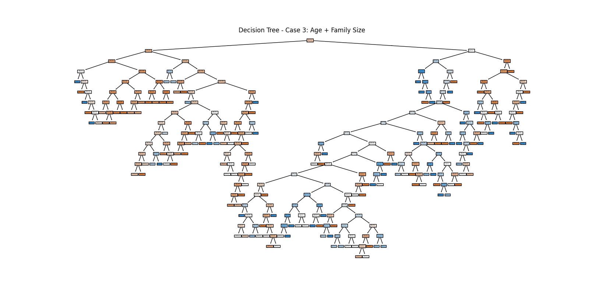

# Project 03:  Building a Classifier (Titanic)

## Project Overview

In this project, we use the Titanic dataset to build and compare three classifiers:  Decision Tree, Support Vector Machine, and Neural Network.

We test each model across three different feature sets and evaluate their performance in predicting passenger survival.

Decision Tree (DT) – Splits data into smaller groups based on simple rules.

Support Vector Machine (SVM) – Finds the best boundary (hyperplane) that separates data into classes.

Neural Network (NN) – Uses layers of connected “neurons” to learn complex, non-linear patterns.

## Activate Project Virtual Environment

Since this project (and future projects for this course) all use the same repository, they will all use the same local virtual environment created for Project 01. All that needs to be done for each project is to activate.

```shell
.\.venv\Scripts\activate
```

## Create new project directory and files with VS Code

Inside the notebooks directory, create a project03 subdirectory with the following files inside:
ml03_pinkston.ipynb
README.md

## Run the following test and prepatory commands

```shell
git add .
uvx ruff check --fix
uvx pre-commit autoupdate
uv run pre-commit run --all-files
git add .
uv run pytest
```

## Run initial Git Add / Commit / Push

```shell
git add .
git commit -m "initial commit"
git push -u origin main
```

## Create Heading and Introduction sections of Project 02

Project 03:  Building a Classifier (Titanic)
Author:  James Pinkston  
Date:  November 9, 2025  
Objective:  P3: Evaluate three classifiers using the Titantic dataset:  Decision Tree, Support Vector Machine, and Neural Network.

## Create Section 1 of Project 03

Section 1. Import and Inspect the Data

```shell
# All imports should be at the top of the notebook

import pandas as pd
import seaborn as sns
import matplotlib.pyplot as plt
import numpy as np

from matplotlib.colors import ListedColormap
from sklearn.model_selection import StratifiedShuffleSplit
from sklearn.tree import DecisionTreeClassifier, plot_tree
from sklearn.svm import SVC
from sklearn.neural_network import MLPClassifier
from sklearn.metrics import classification_report, confusion_matrix

# Load Titanic Dataset
titanic = sns.load_dataset('titanic')

titanic.head()
```

## Create Section 2 of Project 03

Section 2. Data Exploration and Preparation

### 2.1 Handle Missing Values and Clean Data

Impute missing values for age using the median:

```shell
median_age = titanic['age'].median()
titanic['age'] = titanic['age'].fillna(median_age)
```
Fill in the missing values for embark_town using the mode:
```shell
mode_embark = titanic['embark_town'].mode()[0]
titanic['embark_town'] = titanic['embark_town'].fillna(mode_embark)
```

### 2.2 Feature Engineering

Create new features

 - Add family_size - number of family members on board. Count sibsp (number of siblings or spouses on board), parch (number of parents or children on board), and 1 to count the individual.
 - Convert categorical "sex" (male/female) to numeric binary (0 or 1): male =0, female=1
 - Convert categorical "embarked" to numeric: "C" (Cherboug) = 0, "Q" (Queenstown) = 1, "S" (Southampton) = 2
 - Binary feature - convert "alone" to numeric binary (0 or 1): alone = 1, 0 = not alone

```shell
# Create new feature
titanic['family_size'] = titanic['sibsp'] + titanic['parch'] + 1

# Map categories to numeric values
titanic['sex'] = titanic['sex'].map({'male': 0, 'female': 1})
titanic['embarked'] = titanic['embarked'].map({'C': 0, 'Q': 1, 'S': 2})
titanic['alone'] = titanic['alone'].astype(int)
```

## Section 3. Feature Selection and Justification

### 3.1 Choose Features and Target

- Select two or more input features (numerical for regression, numerical and/or categorical for classification)
- Use **survived** as the target. 
- We will do three input cases like the example. 

Case 1: 

- input features:  alone
- target:  survived

Case 2:

- input features:  age
- target:  survived

Case 3:

- input features:  age and family_size 
- target:  survived

### 3.2 Define X (features) and y (target)

- Assign input features to X - a pandas DataFrame with 1 or more input features
- Assign target variable to y (as applicable) - a pandas Series with a single target feature
- Again - use comments to run a single case at a time
- The following starts with only the statements needed for Case 1.
- Double brackets [[]] makes a 2D DataFrame
- Single brackets [] make a 1D Series

```shell
# Case 1: Feature = alone

# Select the feature 'alone' as input
X1 = titanic[['alone']]

# Select 'survived' as the target for the same rows
y1 = titanic['survived']
```
```shell
# Case 2: Feature = age (drop if na or not available)

# Select the feature 'age', but drop rows where age is missing
X2 = titanic[['age']].dropna()

# Select the matching 'survived' values using the same index
y2 = titanic.loc[X2.index, 'survived']
```
```shell
# Case 3: Features = age + family size (drop if na or not available)

# Select both 'age' and 'family_size', and drop rows where missing (na)
X3 = titanic[['age', 'family_size']].dropna()

# Select the corresponding 'survived' values for those rows
y3 = titanic.loc[X3.index, 'survived']
```

## Section 4. Train a Classification Model (Decision Tree)

### 4.1 Split the Data

Split the data into training and test sets.

```shell
# Case 1: Feature = alone

splitter1 = StratifiedShuffleSplit(n_splits=1, test_size=0.2, random_state=123)
for train_idx1, test_idx1 in splitter1.split(X1, y1):
    X1_train = X1.iloc[train_idx1]
    X1_test = X1.iloc[test_idx1]
    y1_train = y1.iloc[train_idx1]
    y1_test = y1.iloc[test_idx1]

print('Case 1 - Alone:')
print('Train Size:', len(X1_train), '| Test Size:', len(X1_test))
```
```text
Case 1 - Alone:
Train Size: 712 | Test Size: 179
```

```shell
# Case 2: Feature = age

splitter2 = StratifiedShuffleSplit(n_splits=1, test_size=0.2, random_state=123)
for train_idx2, test_idx2 in splitter2.split(X2, y2):
    X2_train = X2.iloc[train_idx2]
    X2_test = X2.iloc[test_idx2]
    y2_train = y2.iloc[train_idx2]
    y2_test = y2.iloc[test_idx2]

print('Case 2 - Age:')
print('Train Size:', len(X2_train), '| Test Size:', len(X2_test))
```
```text
Case 2 - Age:
Train Size: 712 | Test Size: 179
```

```shell
# Case 3: Feature = age + family_size

splitter3 = StratifiedShuffleSplit(n_splits=1, test_size=0.2, random_state=123)
for train_idx3, test_idx3 in splitter3.split(X3, y3):
    X3_train = X3.iloc[train_idx3]
    X3_test = X3.iloc[test_idx3]
    y3_train = y3.iloc[train_idx3]
    y3_test = y3.iloc[test_idx3]

print('Case 3 - Age + Family Size:')
print('Train Size:', len(X3_train), '| Test Size:', len(X3_test))
```
```text
Case 3 - Age + Family Size:
Train Size: 712 | Test Size: 179
```

### ### 4.2 Create and Train Model (Decision Tree)

Create and train a decision tree model with no random initializer argument.

Create and train all 3 cases.
```shell
# Case 1: Decision Tree using alone
tree_model1 = DecisionTreeClassifier()
tree_model1.fit(X1_train, y1_train)
```
```shell
# Case 2: Decision Tree using age
tree_model2 = DecisionTreeClassifier()
tree_model2.fit(X2_train, y2_train)
```
```shell
# Case 3: Decision Tree using age and family_size
tree_model3 = DecisionTreeClassifier()
tree_model3.fit(X3_train, y3_train)
```

### ### 4.3 Predict and Evaluate Model Performance

Evaluate model performance on training data.

Predict and evaluate all 3 cases.
```shell
# Predict on training data
y1_pred = tree_model1.predict(X1_train)
print("Results for Decision Tree on Training Data (Case 1 - alone):")
print(classification_report(y1_train, y1_pred))

# Predict on test data
y1_test_pred = tree_model1.predict(X1_test)
print("Results for Decision Tree on Test Data (Case 1 - alone):")
print(classification_report(y1_test, y1_test_pred))
```
```text
Results for Decision Tree on Training Data (Case 1 - alone):
              precision    recall  f1-score   support

           0       0.69      0.69      0.69       439
           1       0.50      0.51      0.51       273

    accuracy                           0.62       712
   macro avg       0.60      0.60      0.60       712
weighted avg       0.62      0.62      0.62       712

Results for Decision Tree on Test Data (Case 1 - alone):
              precision    recall  f1-score   support

           0       0.71      0.65      0.68       110
           1       0.51      0.58      0.54        69

    accuracy                           0.63       179
   macro avg       0.61      0.62      0.61       179
weighted avg       0.64      0.63      0.63       179
```

```shell
# Predict on training data
y2_pred = tree_model2.predict(X2_train)
print("Results for Decision Tree on Training Data (Case 2 - age):")
print(classification_report(y2_train, y2_pred))

# Predict on test data
y2_test_pred = tree_model2.predict(X2_test)
print("Results for Decision Tree on Test Data (Case 2 - age):")
print(classification_report(y2_test, y2_test_pred))
```
```text
Results for Decision Tree on Training Data (Case 2 - age):
              precision    recall  f1-score   support

           0       0.68      0.92      0.78       439
           1       0.69      0.29      0.41       273

    accuracy                           0.68       712
   macro avg       0.68      0.61      0.60       712
weighted avg       0.68      0.68      0.64       712

Results for Decision Tree on Test Data (Case 2 - age):
              precision    recall  f1-score   support

           0       0.63      0.89      0.74       110
           1       0.50      0.17      0.26        69

    accuracy                           0.61       179
   macro avg       0.57      0.53      0.50       179
weighted avg       0.58      0.61      0.55       179
```

```shell
# Predict on training data
y3_pred = tree_model3.predict(X3_train)
print("Results for Decision Tree on Training Data (Case 3 - age + family_size):")
print(classification_report(y3_train, y3_pred))

# Predict on test data
y3_test_pred = tree_model3.predict(X3_test)
print("Results for Decision Tree on Test Data (Case 3 - age + family_size):")
print(classification_report(y3_test, y3_test_pred))
```
```text
Results for Decision Tree on Training Data (Case 3 - age + family_size):
              precision    recall  f1-score   support

           0       0.77      0.90      0.83       439
           1       0.77      0.56      0.65       273

    accuracy                           0.77       712
   macro avg       0.77      0.73      0.74       712
weighted avg       0.77      0.77      0.76       712

Results for Decision Tree on Test Data (Case 3 - age + family_size):
              precision    recall  f1-score   support

           0       0.64      0.75      0.69       110
           1       0.45      0.33      0.38        69

    accuracy                           0.59       179
   macro avg       0.55      0.54      0.54       179
weighted avg       0.57      0.59      0.57       179
```

### 4.4 Report Confusion Matrix (as a heatmap)

Plot a confusion matrix as a heatmap.

Plot for all cases.

```shell
# Create confusion matrix for test predictions (Case 1)
cm1 = confusion_matrix(y1_test, y1_test_pred)

# Plot heatmap
sns.heatmap(cm1, annot=True, cmap='Blues')
plt.title('Confusion Matrix - Case 1: Alone')
plt.xlabel('Predicted')
plt.ylabel('Actual')
plt.show()
```

```shell
# Create confusion matrix for test predictions (Case 2)
cm2 = confusion_matrix(y2_test, y2_test_pred)

# Plot heatmap
sns.heatmap(cm2, annot=True, cmap='Blues')
plt.title('Confusion Matrix - Case 2: Age')
plt.xlabel('Predicted')
plt.ylabel('Actual')
plt.show()
```

```shell
# Create confusion matrix for test predictions (Case 3)
cm3 = confusion_matrix(y3_test, y3_test_pred)

# Plot heatmap
sns.heatmap(cm3, annot=True, cmap='Blues')
plt.title('Confusion Matrix - Case 3: Age + Family Size')
plt.xlabel('Predicted')
plt.ylabel('Actual')
plt.show()
```

### 4.5 Report Decision Tree Plot

Plot the decision tree model for each case.

Case 1
```shell
# Plot Decision Tree for Case 1
fig = plt.figure(figsize=(12, 6))
plot_tree(tree_model1,
          feature_names=X1.columns,
          class_names=['Not Survived', 'Survived'],
          filled=True)
plt.title("Decision Tree - Case 1: Alone")

# Save image
fig.savefig("tree_case1_alone.png")

plt.show()
```


Case 2
``` shell
# Plot Decision Tree for Case 2
fig = plt.figure(figsize=(12, 6))
plot_tree(tree_model2,
          feature_names=X2.columns,
          class_names=['Not Survived', 'Survived'],
          filled=True)
plt.title("Decision Tree - Case 2: Age")

# Save image
fig.savefig("tree_case2_age.png")

plt.show()
```


Case 3
```shell
# Plot Decision Tree for Case 3
fig = plt.figure(figsize=(16, 8))
plot_tree(tree_model3,
          feature_names=X3.columns,
          class_names=['Not Survived', 'Survived'],
          filled=True)
plt.title("Decision Tree - Case 3: Age + Family Size")

# Save image
fig.savefig("tree_case3_age_family.png")

plt.show()
```


## Section 5. Compare Alternative Models (SVC, NN)

In a Support Vector Machine, the kernel function defines how the algorithm transforms data to find a hyperplane that separates the classes. If the data is not linearly separable, changing the kernel can help the model find a better decision boundary.

SVC Kernel: Common Types

- RBF (Radial Basis Function) – Most commonly used; handles non-linear data well (default)
- Linear – Best for linearly separable data (straight line separation)
- Polynomial – Useful when the data follows a curved pattern
- Sigmoid – Similar to a neural network activation function; less common

Commenting the options in and out in the code can be helpful. The analyst decides which to use based on their understanding of the results.

```text
# RBF Kernel (default) - same as calling SVC()
svc_model = SVC(kernel='rbf')
svc_model.fit(X_train, y_train)

# Linear Kernel
svc_model = SVC(kernel='linear')
svc_model.fit(X_train, y_train)

# Polynomial Kernel (e.g., with degree=3)
svc_model = SVC(kernel='poly', degree=3)
svc_model.fit(X_train, y_train)

# Sigmoid Kernel
svc_model = SVC(kernel='sigmoid')
svc_model.fit(X_train, y_train)
```

SVC Kernel: How to Choose

- Start with linear if you suspect the data is linearly separable.
- Use RBF if the data is complex or you aren’t sure.
- Try polynomial if the data seems to follow a curved boundary.
- Use sigmoid for experiments (rarely the best choice).

SVC Kernel: Common Issues and Techniques

- If the model takes too long to train, reduce the degree for polynomial kernels.
- If support_vectors_ gives an error, the data may not be separable with the current kernel. Try switching to RBF or adjusting the C (regularization) value.
- If the model misclassifies many points, then increase/decrease gamma or C.

Your process is valuable - record the work you do and the temporary results in your reflections and insights. To show your skills, show and tell us about your analysis process. Professional communication is key.

### 5.1 Train and Evaluate Model (SVC)

First, train an SVC model using the default kernel.

Case 1
```shell
# Case 1: SVC using 'alone'

svc_model1 = SVC()
svc_model1.fit(X1_train, y1_train)
y1_svc_pred = svc_model1.predict(X1_test)
print(classification_report(y1_test, y1_svc_pred))
```
```text
              precision    recall  f1-score   support

           0       0.71      0.65      0.68       110
           1       0.51      0.58      0.54        69

    accuracy                           0.63       179
   macro avg       0.61      0.62      0.61       179
weighted avg       0.64      0.63      0.63       179
```

Case 2
```shell
# Case 2: SVC using 'age'

svc_model2 = SVC()
svc_model2.fit(X2_train, y2_train)
y2_svc_pred = svc_model2.predict(X2_test)
print(classification_report(y2_test, y2_svc_pred))
```
```text
              precision    recall  f1-score   support

           0       0.63      0.98      0.77       110
           1       0.71      0.07      0.13        69

    accuracy                           0.63       179
   macro avg       0.67      0.53      0.45       179
weighted avg       0.66      0.63      0.52       179
```

Case 3
```shell
# Case 3: SVC using 'age' and 'family_size'

svc_model3 = SVC()
svc_model3.fit(X3_train, y3_train)
y3_svc_pred = svc_model3.predict(X3_test)
print(classification_report(y3_test, y3_svc_pred))
```
```text
              precision    recall  f1-score   support

           0       0.63      0.98      0.77       110
           1       0.71      0.07      0.13        69

    accuracy                           0.63       179
   macro avg       0.67      0.53      0.45       179
weighted avg       0.66      0.63      0.52       179
```

### 5.2 Visualize Support Vectors (1D Case 1 and 2D Case 3)

We can create scatter plots to visualize support vectors. This helps understand how the SVM model separates the data. We'll use Case 1 first - but since it only has one dimension, it's kind of boring. Try to do so for Case 2 as well, but it is also only one input, and one case. Then, we'll do Case 3. Since Case 3 has two inputs, the plot has two dimensions, and our division will hopefully show a two dimensional division (like a line or margin). 
To visualize support vectors, we follow a 3 step process. 

Step 1) Split the data into two groups:
- Survived – Passengers who survived the Titanic sinking (value = 1).
- Not Survived – Passengers who did not survive (value = 0).

Step 2) Plot each category using different shapes and colors:
- Yellow squares ('s') for survived passengers
- Cyan triangles ('^') for non-survived passengers

Step 3) Overlay the support vectors — the critical data points used to define the decision boundary — with black plus signs.
- Black pluses ('+') will represent the support vectors.
- Since the support vectors are plotted last, they appear on top of the data points and are not obscured.

```shell
# Visualize support vectors for Case 1 (feature = 'alone')

# Create groups based on survival
survived_alone = X1_test.loc[y1_test == 1, 'alone']
not_survived_alone = X1_test.loc[y1_test == 0, 'alone']

# Create scatter plot for survived and not survived
plt.figure(figsize=(8, 6))

plt.scatter(survived_alone, y1_test.loc[y1_test == 1], c='yellow', marker='s', label='Survived')
plt.scatter(not_survived_alone, y1_test.loc[y1_test == 0], c='cyan', marker='^', label='Not Survived')

# Overlay support vectors
# Check if the model has support_vectors_ (it may not if it failed to converge)
if hasattr(svc_model1, 'support_vectors_'):
    # Get the X-values of the support vectors (only one feature in Case 1
    support_x = svc_model1.support_vectors_[:, 0]  # First feature (alone)
    # Plot them using a fixed Y-value (0.5) to place them between classes visually
    # We use a larger size (s=100) and a plus symbol to make them stand out
    plt.scatter(support_x, [0.5] * len(support_x), c='black', marker='+', s=100, label='Support Vectors')

# Add labels and legend
plt.xlabel('Alone')
plt.ylabel('Survived (0 or 1)')
plt.title('Support Vectors - SVC (Case 1: Alone)')
plt.legend()
plt.grid(True)
plt.show()
```

### 5.3 Train and Evaluate Model (Neural Network on Case 3)

Now, we'll train a Neural Network (Multi-Layer Perceptron) classifier using age and family_size as input features. This is the most informative case and gives us two continuous features to help the network learn patterns and relationships.

We'll use:

- An input (visible) layer  - with age and family size - that's two input neurons visible to us and the model.
- Three hidden layers with decreasing sizes (50, 25, 10) - These are layers of neurons the model creates to learn patterns. Each neuron receives input from all neurons in the previous layer, applies a function, and passes the result on.
- One output layer - a single neuron with our probability of survival (yes / no for a binary classification). 
- The lbgfs solver which works better with small data sets like the Titanic
- A higher number of maximum iterations (max_iter) to help it converge.
- A fixed random_state so the work is reproducible and doesn't change each time we run it. 
  
Train NN on Case 3
```shell
# Train NN for Case 3 (age + family_size)
nn_model3 = MLPClassifier(
    hidden_layer_sizes=(50, 25, 10),
    solver='lbfgs',
    max_iter=1000,
    random_state=42
)

nn_model3.fit(X3_train, y3_train)
```

Predict and Evaluate Neural Network Model:
```shell
# Predict on test data (Case 3)
y3_nn_pred = nn_model3.predict(X3_test)

# Print classification report
print("Results for Neural Network on Test Data (Case 3 - age + family_size):")
print(classification_report(y3_test, y3_nn_pred))
```
```text
Results for Neural Network on Test Data (Case 3 - age + family_size):
              precision    recall  f1-score   support

           0       0.70      0.78      0.74       110
           1       0.57      0.46      0.51        69

    accuracy                           0.66       179
   macro avg       0.64      0.62      0.63       179
weighted avg       0.65      0.66      0.65       179
```

Plot Confusion Matrix:
```shell
# Create confusion matrix
cm_nn3 = confusion_matrix(y3_test, y3_nn_pred)

# Plot heatmap
sns.heatmap(cm_nn3, annot=True, cmap='Blues')
plt.title('Confusion Matrix - Neural Network (Case 3)')
plt.xlabel('Predicted')
plt.ylabel('Actual')
plt.show()
```

### 5.4 Visualize (Neural Network on Case 3)

We can visualize the learned decision boundary of the neural network - the way it separates the two target classes into survived and not-survived. Since we have two features (age and family_size), we can create a 2D plot showing how the model predicts across different combinations of those features.

This is a great way to visualize decision boundaries — regions where the model switches from predicting not-survived to survived.

```shell
# Get the range of our two features - use padding to enhance appearance
padding = 1
x_min, x_max = X3['age'].min() - padding, X3['age'].max() + padding
y_min, y_max = X3['family_size'].min() - padding, X3['family_size'].max() + padding

# Create a meshgrid (all combinations of age and family_size)

# A grid of values covering the entire input space
# np.linspace(start, stop, num) generates evenly spaced values (like a ruler)
# Here, we create 500 points between min and max for each axis
# np.meshgrid creates a coordinate grid from the two arrays
xx, yy = np.meshgrid(np.linspace(x_min, x_max, 500), 
                     np.linspace(y_min, y_max, 500))

# Flatten the grid arrays and prepare them for prediction
# np.c_ stacks the flattened xx and yy into coordinate pairs
# .ravel() flattens a 2D array into 1D (required by the model for prediction)
Z = nn_model3.predict(np.c_[xx.ravel(), yy.ravel()])

# Reshape the predicted results to match the original 2D grid shape
Z = Z.reshape(xx.shape)

# Plot the decision surface (background) showing predicted survival zones
# Blue for 0, yellow for 1 - change this up as you like
plt.figure(figsize=(10, 7))
cmap_background = ListedColormap(['lightblue', 'lightyellow'])
plt.contourf(xx, yy, Z, cmap=cmap_background, alpha=0.7)

# Overlay the actual test data points for visual comparison
# Plot passengers who did NOT survive (0) as blue triangles
plt.scatter(X3_test['age'][y3_test == 0],
            X3_test['family_size'][y3_test == 0],
            c='blue', marker='^', edgecolor='k', label='Not Survived')

# Plot passengers who DID survive (1) as gold squares
plt.scatter(X3_test['age'][y3_test == 1],
            X3_test['family_size'][y3_test == 1],
            c='gold', marker='s', edgecolor='k', label='Survived')

# Add axis labels, title, legend, and grid
plt.xlabel('Age')
plt.ylabel('Family Size')
plt.title('Neural Network Decision Surface - Case 3')
plt.legend()
plt.grid(True)
plt.show()
```

### Other

Train NN on Case 1 and Case 2 (for completing summary table)
```shell
# Train NN for Case 1 (alone)
nn_model1 = MLPClassifier(
    hidden_layer_sizes=(50, 25, 10),
    solver='lbfgs',
    max_iter=1000,
    random_state=42
)

nn_model1.fit(X1_train, y1_train)

# Train NN for Case 2 (age)
nn_model2 = MLPClassifier(
    hidden_layer_sizes=(50, 25, 10),
    solver='lbfgs',
    max_iter=1000,
    random_state=42
)

nn_model2.fit(X2_train, y2_train)
```

Predict and Evaluate Neural Network Model (Case 1):
```shell
# Predict on test data (Case 1)
y1_nn_pred = nn_model1.predict(X1_test)

# Print classification report
print("Results for Neural Network on Test Data (Case 1 - alone):")
print(classification_report(y1_test, y1_nn_pred))
```
```text
Results for Neural Network on Test Data (Case 1 - alone):
              precision    recall  f1-score   support

           0       0.71      0.65      0.68       110
           1       0.51      0.58      0.54        69

    accuracy                           0.63       179
   macro avg       0.61      0.62      0.61       179
weighted avg       0.64      0.63      0.63       179
```

Predict and Evaluate Neural Network Model (Case 2):
```shell
# Predict on test data (Case 2)
y2_nn_pred = nn_model2.predict(X2_test)

# Print classification report
print("Results for Neural Network on Test Data (Case 2 - age):")
print(classification_report(y2_test, y2_nn_pred))
```
```text
Results for Neural Network on Test Data (Case 2 - age):
              precision    recall  f1-score   support

           0       0.63      0.98      0.77       110
           1       0.71      0.07      0.13        69

    accuracy                           0.63       179
   macro avg       0.67      0.53      0.45       179
weighted avg       0.66      0.63      0.52       179
```

## Section 6. Final Thoughts & Insights

1. Summarize Findings

| Model Type | Case | Features Used | Accuracy | Precision | Recall | F1-Score | Notes |
|------------|------|---------------|----------|-----------|--------|-----------|-------|
| Decision Tree | Case 1 | alone | 63.00% | 64.00% | 63.00% | 63.00% | - |
|                   | Case 2 | age | 61.00% | 58.00% | 61.00% | 55.00% | - |
|                   | Case 3 | age + family_size | 59.00% | 57.00% | 59.00% | 57.00% | - |
|-------------------|------|---------------|----------|-----------|--------|-----------|-------|
| SVM (RBF Kernel)| Case 1 | alone | 63.00% | 64.00% | 63.00% | 63.00% | - |
|                    | Case 2 | age | 63.00% | 66.00% | 63.00% | 52.00% | - |
|                    | Case 3 | age + family_size | 63.00% | 66.00% | 63.00% | 52.00% | - |
|-------------------|------|---------------|----------|-----------|--------|-----------|-------|
| Neural Network (MLP) | Case 1 | alone | 63.00% | 64.00% | 63.00% | 63.00% | - |
|                    | Case 2 | age | 63.00% | 66.00% | 63.00% | 52.00% | - |
|                    | Case 3 | age + family_size | 66.00% | 65.00% | 66.00% | 65.00% | - |

2. Discuss Challenges Faced

**This project took a lot longer than I anticipated, and really more time than I typically have available. It makes me extremely worried about the Midterm because since that's a Week 4 assignment, I haven't started it yet. Other than that there weren't really that many challenges. It just took a lot of time.**

3. Next steps to gain more insights and/or to explore classification models

**I don't see myself using any of these models in the future, mostly because my trajectory over the next few years won't include using any of them. It's been interesting learning about them though.**